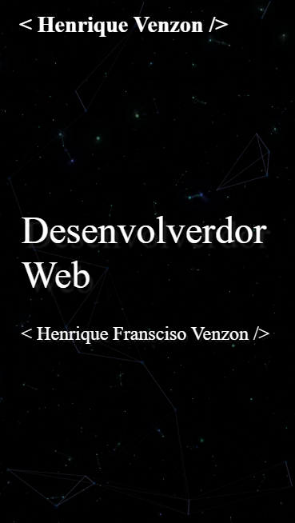

# Portfólio Pessoal

[**Acesse o Portfólio Online**](https://portfolio-venzon.vercel.app/)

## Sobre o Projeto
Este é o meu portfólio pessoal desenvolvido para apresentar meus projetos, habilidades e experiência. O site tem como objetivo funcionar como uma vitrine digital para destacar meu trabalho e facilitar a conexão com recrutadores e parceiros.

## Funcionalidades
- **Exibição de Projetos**: Detalhes e links para repositórios e demonstrações de projetos realizados.
- **Seção Sobre Mim**: Resumo da minha formação, habilidades e certificações.
- **Contato**: Links para redes sociais e formulário de contato.

## Tecnologias Utilizadas
Este projeto foi desenvolvido com as seguintes tecnologias:

- **HTML**: Estrutura do conteúdo do site.
- **CSS**: Estilização e responsividade.
- **JavaScript**: Funcionalidades dinâmicas e interativas.

- ## Contato
- **Autor**: Henrique Francisco Venzon
- **E-mail**: [venzonhenriquef@gmail.com](mailto:venzonhenriquef@gmail.com)
- [LinkedIn](https://linkedin.com/in/henrique-venzon)
- [GitHub](https://github.com/Henrique-Venzon)
